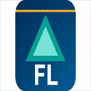
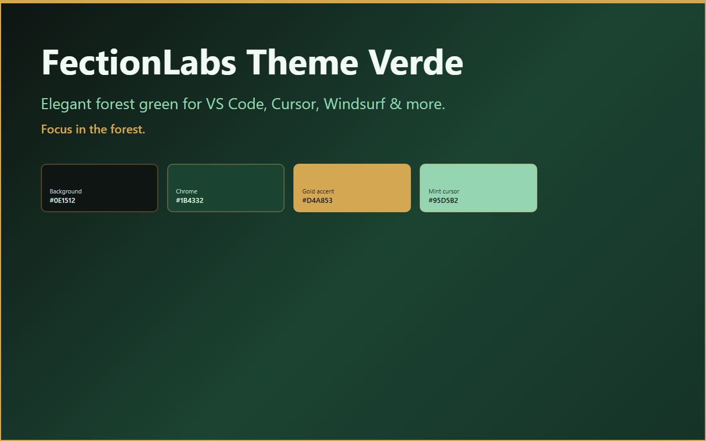
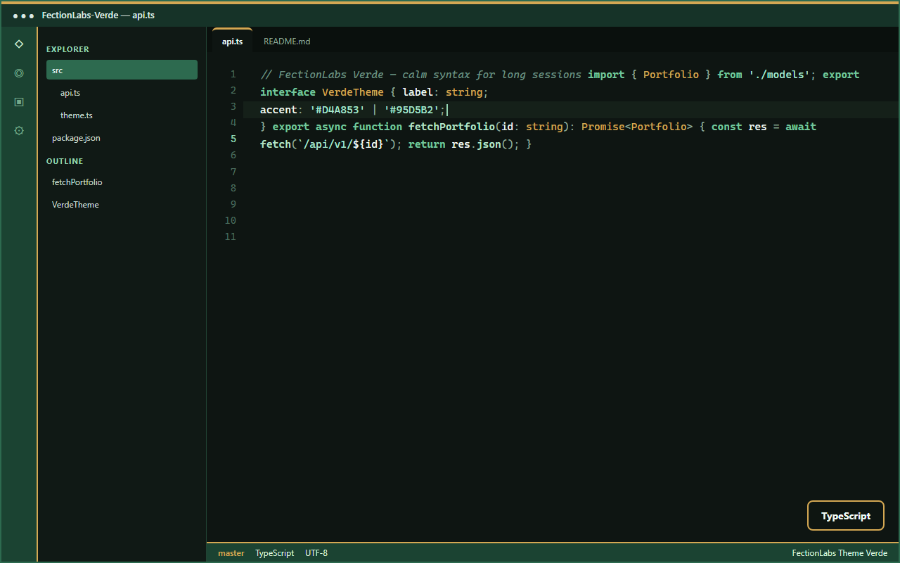
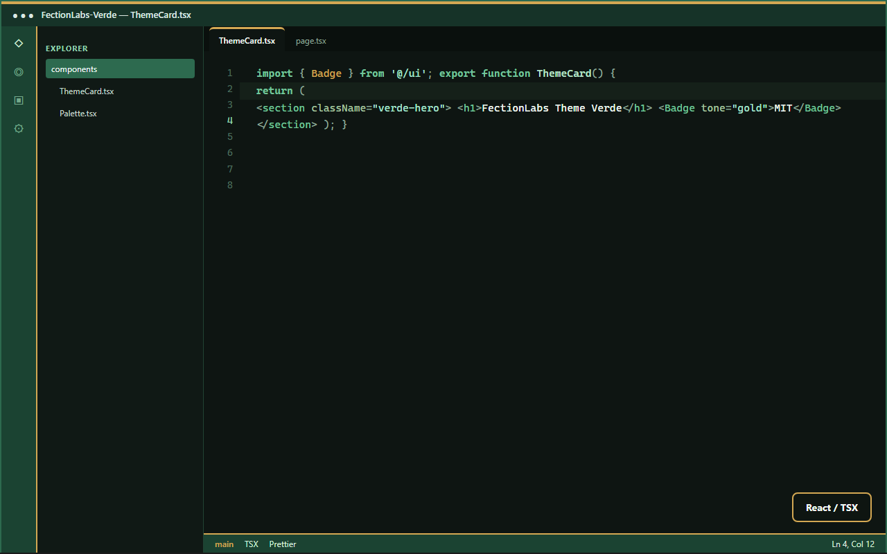

<div align="center">


<br /><br />



# FectionLabs Theme Verde

**Calm forest green for long coding sessions**

[](LICENSE)
[](CHANGELOG.md)
[](https://marketplace.visualstudio.com/items?itemName=fectionlabs.fectionlabs-verde-theme)
[](https://open-vsx.org/extension/fectionlabs/fectionlabs-verde-theme)

*Standalone edition of the most-loved mood from [FectionLabs Themes](https://github.com/ApiCentraal/FectionLabs-Themepack)*

</div>

---

## Preview

<div align="center">







<br />

*TypeScript & React — forest chrome, champagne-gold tab stripe, mint cursor*

</div>

---

## Why Verde?

Verde is a dark theme built around deep forest greens and soft sage text. It keeps the FectionLabs signature — **champagne-gold tab stripe** and status bar accent — while staying calm enough for all-day focus work.

| | |
|---|---|
| **Mood** | Calm, focused, natural |
| **Type** | Dark (`vs-dark`) |
| **Best for** | Long sessions, AI-assisted coding, evening work |
| **Signature** | Forest chrome + gold accents |

## Color palette

| Token | Hex | Usage |
|-------|-----|--------|
| Forest deep | `#0E1512` | Editor background |
| Forest | `#1B4332` | Activity bar, status bar |
| Emerald | `#52B788` | Focus borders, storage types |
| Mint | `#95D5B2` | Cursor, active line numbers |
| Sage | `#DCE8E3` | Primary text |
| Champagne gold | `#D4A853` | Active tab stripe, badges, types |
| Soft green | `#74C69D` | Keywords, HTML tags |
| Pale mint | `#A8E6CF` | Strings |

## Install

Search **FectionLabs Theme Verde** in your editor extension panel.

| Registry | Editors |
|----------|---------|
| [Visual Studio Marketplace](https://marketplace.visualstudio.com/items?itemName=fectionlabs.fectionlabs-verde-theme) | VS Code, Cursor |
| [Open VSX](https://open-vsx.org/extension/fectionlabs/fectionlabs-verde-theme) | Windsurf, VSCodium, Antigravity |

Works in **VS Code**, **Cursor**, **Windsurf**, **VSCodium**, **Trae**, **Antigravity IDE**, and other VS Code-compatible editors.

## Activate

`Ctrl+K` then `Ctrl+T` → **FectionLabs Theme Verde**

```json
"workbench.colorTheme": "FectionLabs Theme Verde"
```

## Settings

| Setting | Default | Description |
|---------|---------|-------------|
| `fectionlabsVerde.enableCustomCursor` | `true` | Mint cursor when Verde is active |
| `fectionlabsVerde.enableLineHighlight` | `true` | Subtle green line highlight |

## Want all twelve themes?

For Dark, Light, Bright, Aurora, Cobalt, and more:

**[FectionLabs Themes — full pack](https://github.com/ApiCentraal/FectionLabs-Themepack)**

## Changelog

See [CHANGELOG.md](./CHANGELOG.md).

## License

MIT — free to use, modify, and share.
